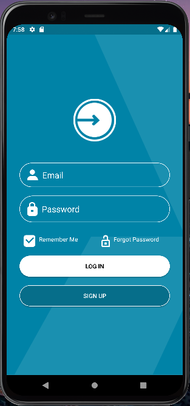

## *Membuat Login App*



Berikut ini adalah cara membuat login apps dengan menggunakan android studio 
disini menggunakan bahasa pemrograman kotlin

adapun langkah langkahnya sebagai berikut

**code file activity_main.xml**

```bash
<?xml version="1.0" encoding="utf-8"?>
<LinearLayout
    xmlns:android="http://schemas.android.com/apk/res/android"
    xmlns:app="http://schemas.android.com/apk/res-auto"
    xmlns:tools="http://schemas.android.com/tools"
    android:layout_width="match_parent"
    android:layout_height="match_parent"
    android:orientation="vertical"
    android:background="@drawable/bg"
    tools:context=".MainActivity">

    <ImageView
        android:id="@+id/image"
        android:layout_width="100dp"
        android:layout_height="100dp"
        android:src="@drawable/logo"
        android:layout_gravity="center"
        android:layout_marginTop="150dp"/>

    <EditText
        android:id="@+id/editText1"
        android:layout_width="match_parent"
        android:layout_height="wrap_content"
        android:inputType="textEmailAddress"
        android:text="Email"
        android:drawableLeft="@drawable/ic_usr"
        android:textSize="20dp"
        android:drawablePadding="10dp"
        android:background="@drawable/shapestroke"
        android:textColor="@color/white"
        android:layout_marginLeft="30dp"
        android:layout_marginRight="30dp"
        android:paddingTop="15dp"
        android:paddingBottom="15dp"
        android:paddingLeft="18dp"
        android:layout_marginTop="50dp"
        android:layout_gravity="center"/>

    <EditText
        android:id="@+id/editText2"
        android:layout_width="match_parent"
        android:layout_height="wrap_content"
        android:inputType="textPersonName"
        android:text="Password"
        android:drawableLeft="@drawable/ic_lock"
        android:textSize="20dp"
        android:drawablePadding="10dp"
        android:background="@drawable/shapestroke"
        android:textColor="@color/white"
        android:layout_marginLeft="30dp"
        android:layout_marginRight="30dp"
        android:paddingTop="15dp"
        android:paddingBottom="15dp"
        android:paddingLeft="18dp"
        android:layout_marginTop="20dp"
        android:layout_gravity="center"/>

    <LinearLayout
        android:layout_width="wrap_content"
        android:layout_height="wrap_content"
        android:orientation="horizontal"
        android:layout_marginTop="30dp">

        <TextView
            android:id="@+id/textView1"
            android:layout_width="match_parent"
            android:layout_height="wrap_content"
            android:text="Remember Me"
            android:textColor="@color/white"
            android:drawablePadding="8dp"
            android:drawableLeft="@drawable/ic_ceklis"
            android:layout_marginLeft="40dp" />

        <TextView
            android:id="@+id/textView2"
            android:layout_width="match_parent"
            android:layout_height="wrap_content"
            android:text="Forgot Password"
            android:textColor="@color/white"
            android:drawablePadding="8dp"
            android:drawableLeft="@drawable/ic_oplock"
            android:layout_marginLeft="55dp"/>

    </LinearLayout>

    <Button
        android:id="@+id/button1"
        android:layout_width="match_parent"
        android:layout_height="wrap_content"
        android:text="LOG IN"
        android:textColor="@color/black"
        android:backgroundTint="@color/white"
        android:background="@drawable/shapefill"
        android:paddingTop="15dp"
        android:paddingBottom="15dp"
        android:layout_marginLeft="30dp"
        android:layout_marginRight="30dp"
        android:layout_marginTop="20dp"/>

    <Button
        android:id="@+id/button2"
        android:layout_width="match_parent"
        android:layout_height="wrap_content"
        android:text="SIGN UP"
        android:textColor="@color/white"
        android:background="@drawable/shapefill2"
        android:paddingTop="15dp"
        android:paddingBottom="15dp"
        android:layout_marginLeft="30dp"
        android:layout_marginRight="30dp"
        android:layout_marginTop="20dp"/>

</LinearLayout>
```

selain pada layout utama, terdapat resource tambahan untuk membuat komponen EditText dan Button menjadi lebih menarik
file ini terletak pada directory res/drawable/
Adapun codenya sebagai berikut

**code shapefill.xml**

```bash
<?xml version="1.0" encoding="utf-8"?>
<selector xmlns:android="http://schemas.android.com/apk/res/android">
    <item>
        <shape>
            <corners android:radius="30dp"/>
            <solid android:color="@color/white" android:width="1dp"/>
        </shape>
    </item>
</selector>
``` 

**code shapefill2.xml**

```bash
<?xml version="1.0" encoding="utf-8"?>
<selector xmlns:android="http://schemas.android.com/apk/res/android">
    <item>
        <shape>
            <corners android:radius="30dp"/>
            <solid android:color="@color/blue" android:width="1dp"/>
            <stroke android:color="@color/white" android:width="1dp"/>
        </shape>
    </item>
</selector>
```

**code shapestroke.xml**

```bash
<?xml version="1.0" encoding="utf-8"?>
<selector xmlns:android="http://schemas.android.com/apk/res/android">
<item>
    <shape>
        <corners android:radius="30dp"/>
        <stroke android:color="@color/white" android:width="1dp"/>
    </shape>
</item>
</selector>
```

terakhir membuat agar status bar berwarna sama dengan background app, menambahkan sedikit script pada MainActivity.kt

**code MainActivity.kt**

```bash
package com.example.mws_kuis

import androidx.appcompat.app.AppCompatActivity
import android.os.Bundle
import android.view.Window
import android.view.WindowManager
import androidx.core.content.ContextCompat

class MainActivity : AppCompatActivity() {
    override fun onCreate(savedInstanceState: Bundle?) {
        super.onCreate(savedInstanceState)
        setContentView(R.layout.activity_main)

        val window: Window = this@MainActivity.window
        window.addFlags(WindowManager.LayoutParams.FLAG_DRAWS_SYSTEM_BAR_BACKGROUNDS)
        window.clearFlags(WindowManager.LayoutParams.FLAG_TRANSLUCENT_STATUS)
        window.statusBarColor = ContextCompat.getColor(this@MainActivity, R.color.blue)
    }
}
```